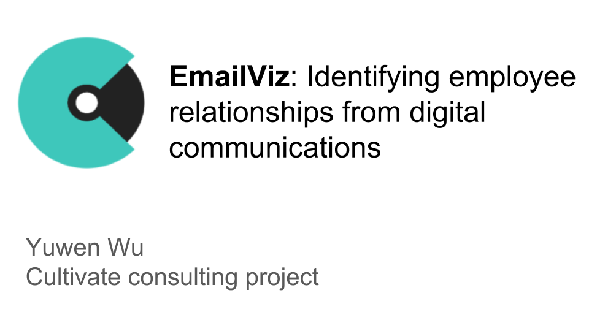

**Introduction**

During my time as an Insight Data Science Fellow, I consulted with Cultivate, a SaaS business whose mission is to provide human resource (HR) departments with a better way to measure and evaluate employees. Prior to joining Insight, I received my Ph.D. from the Program in Neuroscience at Harvard. As I prepared for my transition to industry, I became fascinated by how large organizations manage and motivate employees so that teams can be most productive. I was therefore excited by the opportunity to work with Cultivate to learn about employee communications. Links to my slides can be found [here](https://docs.google.com/presentation/d/1dIz3TKviRqEQ2EHlwv7sysUNxA48TQ0JFhX-fYekRlc/edit#slide=id.g200332bda9_0_58) and my webapp can be found at <viz.services>.

**Problem formulation**

Traditionally, employee performance is predicted based on previous performance reviews and information such as salary, commute time and position. Cultivate aims to change the way HR departments evaluate employees via software that uses machine learning to analyze digital communication data to try and identify employee engagement, motivation and bias. To achieve this goal, Cultivate wanted to identify types of relationships that exist between employees. By relationship types, Cultivate is referring not to employment status (i.e., is an individual a manager or a subordinate) but rather to determine whether, for example, good or bad manager-employee relationships can be identified based on how the individuals communicate. Cultivate asked for two deliverables: 

1. An analysis pipeline that classifies types of employee relationships based on digital communication (email) data
2. A model that predicts how the relationships identified in the above step between individuals evolve over time.

**Data acquisition**

Due to privacy concerns, Cultivate could not share their client companies’ data; however, a widely used dataset to mine insights about email communication is the Enron email database. Following the 2001 Enron scandal and federal investigations, many emails of Enron employees were posted on the web, and this dataset is now publicly available from Carnegie Mellon’s Computer Science department. I downloaded the dataset and converted it from mbox to json. Although there are ~500,000 total messages in the Enron dataset, many of these seemed to be draft emails or other miscellaneous digital documents. To extract insight about employee relationships, I downloaded the emails in the `_sent_mail`, `discussion_threads`, `inbox` and `sent_items` folders, as these were common across all email senders in the database and likely encompass the majority of meaningful communications. In total, there were >12,000 emails in these folders.

**Data preprocessing and feature engineering**

In order to pull out types of relationships between individual senders and recipients, I first identified and removed emails with the following features:

* Messages without a recipient
* Messages where the sender and recipient were the same
* Messages not from an @enron.com address, as these generally represented spam or subscription emails
* Messages from identifiable administrative accounts
* Duplicate messages
* Empty messages
* Messages where `Fw` or `Fwd` appeared in the `Subject` field
* Messages from infrequent message senders (i.e., senders who only sent 1-2 emails in the database)

Removing emails with these features resulted in ~6000 emails for downstream analysis, and performance of unsupervised clustering (see section below) was greatly improved after removal of these entries.

After identifying the set of useable emails for the unsupervised learning task, I performed cleaning of message content. Text data is notoriously messy, and emails are no exception. Although generally NLP applications are concerned with misspellings and multiple references to similar concepts, for my task I was more worried about the inconsistent formatting of the Enron emails. Many messages contained spurious symbols and newline characters. More importantly, many individual messages actually contained within them entire email threads with (usually) a header such as `Original Message` or `From:` and then the original sender. These emails are problematic for two reasons. First, messages often get double counted due to the original message already being present in the dataset. Second, a long thread between individuals ‘contaminates’ the signal from the sender. Note that the data cleaning steps I took here left salutations and signatures intact.

**Identification of employee relationship types**

*Feature engineering*

To make the problem of identifying relationship types more tractable, I broke the problem into two steps. First, I performed sentiment analysis of emails, as sentiment of a message can be a proxy for whether a relationship is positive, negative or neutral. Secondly, I performed clustering of emails to find different types of communications.  

I used the Python package `VADER` (Valence Aware Dictionary and sEntiment Reasoner), which is a deterministic rule-based model trained on social media data to identify polarity of sentiments. For this analysis, I will be showing the compound score produced by `VADER`, which is a weighted composite score of individual positive, neutral and negative scores normalized to be between -1 (most negative) and 1 (most positive). I scored the sentiment of each sentence in a message, then averaged the compound scores to get mean sentiment per email.

Below are example messages scored as positive (`compound > 0.5`), neutral (`-0.5 <= compound <= 0.5`) and negative (`compound < -0.5`):

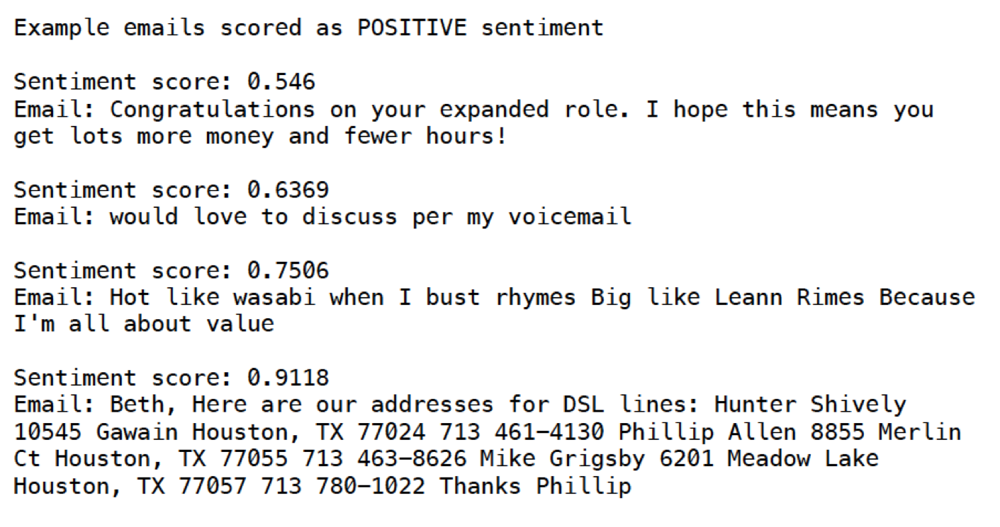

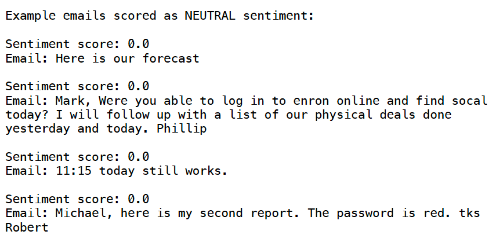

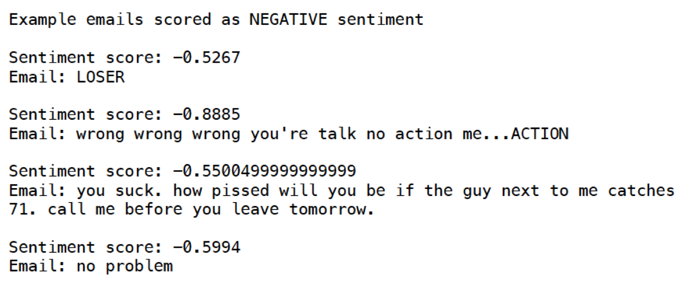

We can see that `VADER` generally correctly scored the sentiment polarity of email messages, though there are some surprising mistakes, such as `no problem` being scored as negative. Overall, on the Enron dataset, `VADER` performed best on neutral emails. 

Plotting the sentiments of email messages over time reveals that sentiments remained relatively stable across the two years represented in the dataset, with the mean hovering around a neutral-positive sentiment score. This is to be expected from a corporate environment where most messages will be centered around business discussions. The line of emails at 0 represents emails where the message was a single sentence or phrase (see the example neutral sentiment emails above).

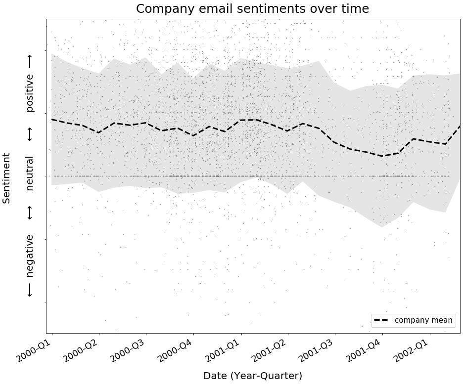

(The gap in emails in the later quarters of 2001 represents the period prior to the Enron scandal becoming public and could be due to either individuals scrubbing their emails and/or the FBI not making those emails available due to their investigation.)

For the purposes of identifying underlying relationships, what individuals are discussing is less salient than how they are discussing that topic. Therefore, rather than perform topic modeling to group emails, I performed unsupervised clustering. I included the `VADER` sentiment scores and the number of recipients as features to distinguish email clusters with different sentiments and those sent to individuals versus groups. I also included various text elements such as sentence length, total word count, number of questions, etc., to measure writing style. I used Python’s `nltk` and `spacy` packages for sentence and word tokenizations, part of speech tagging and other text processing. All together these features resulted in an approximately 30-dimensional feature vector.

*Choosing an algorithm*

A popular and widely employed clustering algorithm is K-Means, which identifies *k* clusters such that the within cluster sum of squares is minimized. The number of clusters *k* must be pre-specified, and in this application, Cultivate did not have a defined number of relationships they suspected were present in the data. Although heuristics like the elbow method can often be used to select the number of clusters, the need to specify *k* is always a challenge of K-Means. K-Means also assumes that all clusters contain a similar number of observations; however, there is no reason to believe that people are sending the same number of different types of emails. I therefore felt that K-Means would be a poor choice for email data.

Two common alternatives to K-Means that do not require specification of the number of clusters and allow for different sized clusters are hierarchical and density-based clustering algorithms. Although the Enron dataset I worked with is small (only ~6000 emails after all cleaning steps), a client’s HR department will have access to all company emails, and depending on company size this could result in a very large dataset. As hierarchical clustering methods require pairwise comparisons between all data points in a set in order to make a decision about combining or splitting clusters, they are at best $O(n^2)$ complexity. Proper implementation of density-based clustering algorithms, namely DBSCAN (density-based spatial clustering of applications with noise) can lead to much faster computations of $O(n \log n)$ complexity.  I used `scikit-learn`'s DBSCAN implementation.

The performance of DBSCAN is affected by three parameters: the distance metric, the minimum number of points that defines a dense region (`minPts`, called `min_samples` in `scikit-learn`) and the maximum distance a point can be from the center of the cluster to be considered part of the cluster (`eps`). To avoid the problems of the curse of dimensionality affecting many distance metrics, I chose to compare data points using cosine similarity. It is generally recommended that minPts and eps be selected based on domain knowledge. As each client’s email dataset will be different, this is a step where Cultivate could provide consultations to bridge the gap between domain experts (HR) and analysts. For my project, I selected a range of commonly suggested values for minPts and eps and implemented a grid-search to find the combination of parameters that resulted in the highest silhouette score. The silhouette score is calculated as the difference, over all samples, between the mean distance to the nearest neighboring cluster and the mean distance to the center of the sample’s assigned cluster divided by the larger of the two distances. A score of 1 indicates perfect separation, while -1 is the worst score. I obtained a silhouette score of 0.099 with `eps = 0.1` and `minPts = 20`, indicating DBSCAN was able to learn some structure within my dataset. 

**Validation of clustering**

As already mentioned, the parameters for DBSCAN clustering were selected based on those that maximized the silhouette score using cosine similarity as a distance metric. I also performed more qualitative validation by examining a sample of emails within each cluster and then assigning labels based on the content and tone of emails. Although this step is subjective, it is necessary in order to interpret the results of clustering. The final types of emails (with examples) are as follows:

1. `Direct and to the point`  

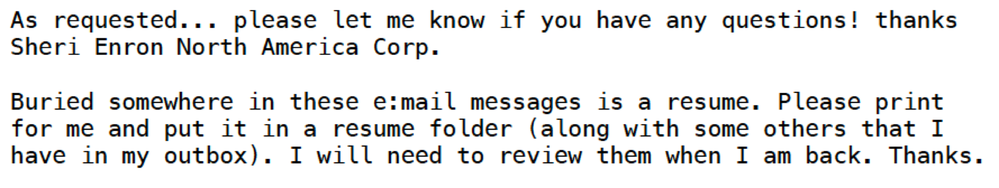

2. `Updates and miscellaneous commentary`: This group was actually the ‘noise’ group consisting of emails DBSCAN could not cluster

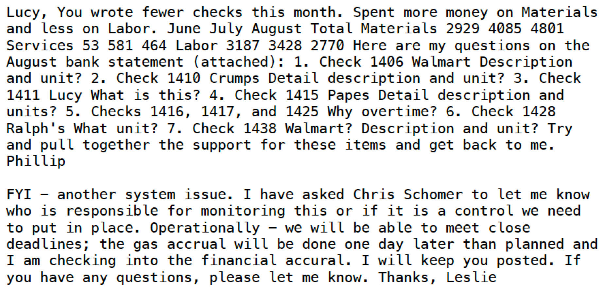

3. `Business discussions`  

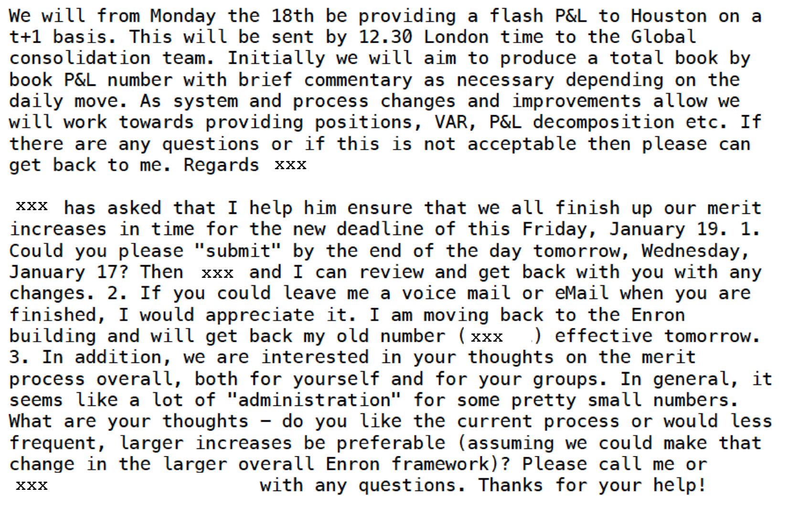

4. `Meetings and interviews`  

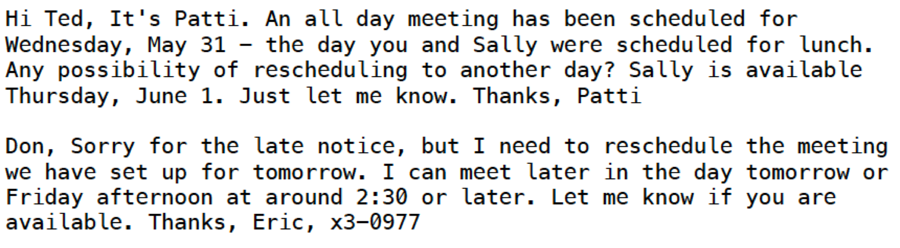

5. `Casual and personal`  

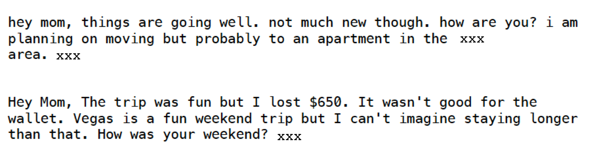

6. `Company announcements`  

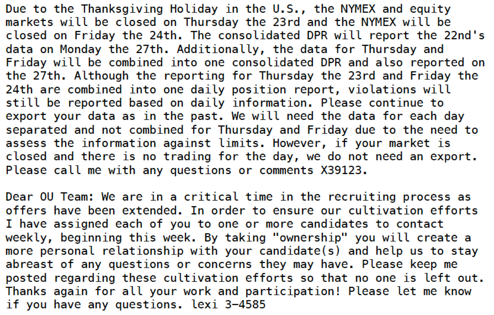

Below are the results from DBSCAN clustering visualized with t-SNE (t-distributed stochastic neighbor embedding):

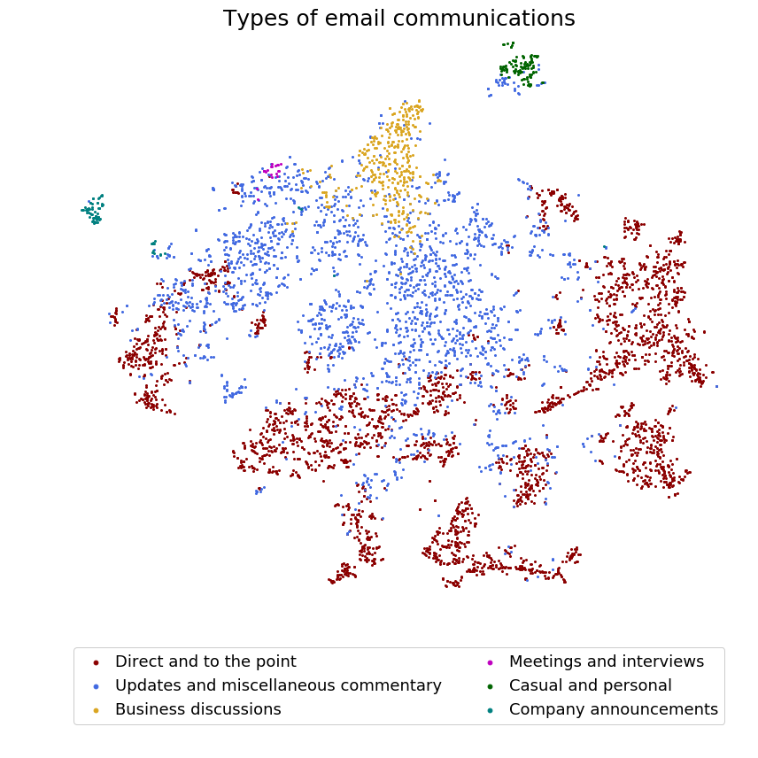

Although the majority of emails are in two large, indistinct clusters, more distinct clusters can be observed, indicating some underlying structure.

Examining the distribution of sentiments within each cluster, it is clear sentiments within the most business-oriented clusters (numbers 1, 2 and 3 from the list above) were close to the company’s overall mean sentiment and were relatively neutral, as expected. Unsurprisingly, `Casual and personal` emails, on the other hand, had more positive sentiment scores relative to the mean.

(Numbers indicate the number of emails per cluster.)

As further qualitative validation, I looked at the distribution of the gender of email senders and recipients within each cluster relative to the distribution of gender within the whole company. Information about gender is not explicitly encoded in the Enron dataset, so I used Python’s `gender_guesser` package to estimate gender from the sender’s or recipient’s first name (in reality, of course, HR would have all this information). If there was more than one recipient, I scored the gender as `group`. For androgynous names, `gender_guesser` scores the name as `mostly_female`, `mostly_male` or `andy` (if the split between male and females with that name is 50:50), while names not in `gender_guesser`'s corpus are scored as `unknown`. I combined `mostly_female` and `mostly_male` names with their respective genders and dropped `andy` names, as fewer than 1% of names fell into these categories.

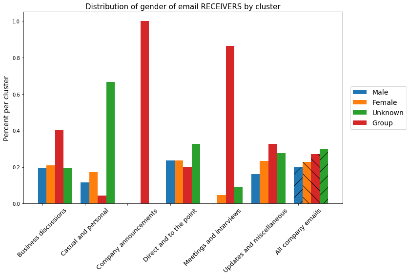

Most clusters were dominated by male senders, and female senders were underrepresented in emails in the `Direct and to the point` and `Meetings and interviews` groups. As one might predict, female senders were extremely overrepresented in the `Company announcements` cluster, while `group` recipients were also overrepresented. Importantly, gender of sender and recipient were not included as a feature in my initial clustering to avoid problems of comparing continuous and categorical features. These results show DBSCAN can identify meaningful clusters within an email dataset and that men and women in Enron were sending different types of emails.  Using this analysis pipeline could allow HR to identify potential biases and differences amongst employees.

It is worth noting that the results from clustering on the Enron dataset are likely skewed because five people in the dataset sent 4108, or 68% of all messages. My clustering analysis may therefore be identifying writing styles of individuals. For example, many personal emails were not captured in the ‘Casual and personal’ cluster, but the emails in that cluster were mainly from Eric Bass. 

**A dashboard for Cultivate clients**

As Cultivate is a SaaS business, any results must ultimately be delivered to client companies in an easily interpretable form for those without much analytics experience. I therefore synthesized the results from my analysis of the Enron emails into a dashboard prototype that Cultivate’s clients could use to visualize digital communications over time, which can be found at <viz.services>. The landing page displays the company's sentiments over time and email types so that  a holistic view of the company can be gained. At the bottom a user can ideally select teams or departments to identify how a group's communications are evolving over time. As I did not have access to this information, for the dashboard prototype I included a sample of individuals from the Enron dataset. Recipients can also be specified so that the relationships between individuals can be visualized.

As an example, if Eric Bass is selected from the drop down menu, we can see the average sentiment of his emails are similar to the company's average sentiment; however, if there were a drop in an individual or team's email sentiments, it could be a sign of problems affecting team dynamics or productivity. Conversely, high sentiments of an individual or team could indicate interactions that should be replicated across the company.

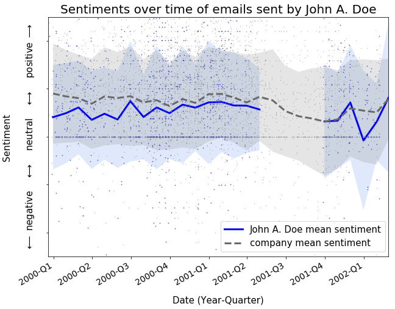

Similarly, the types of emails being sent by a team or individual can be visualized and patterns outside the company norm can be identified.

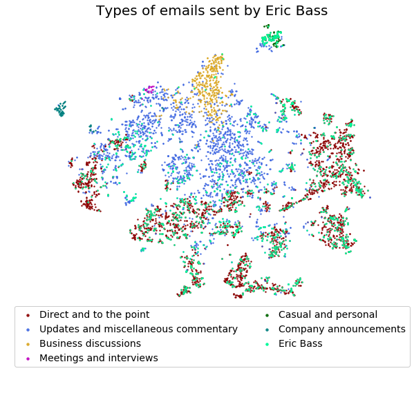
